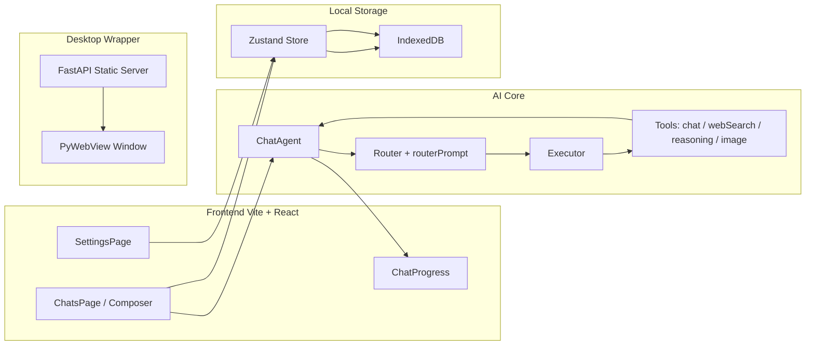
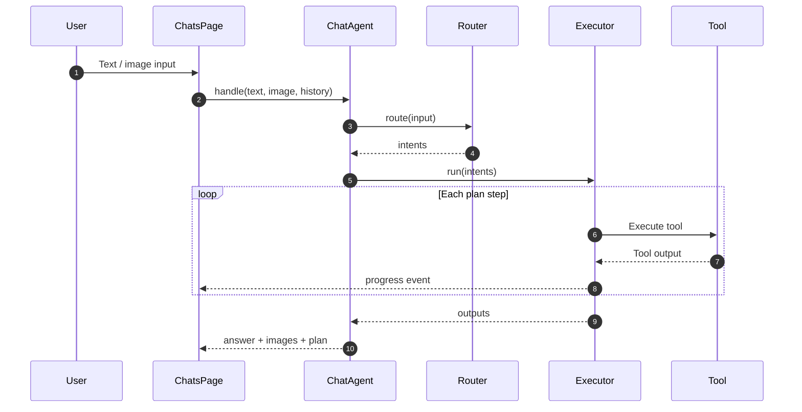
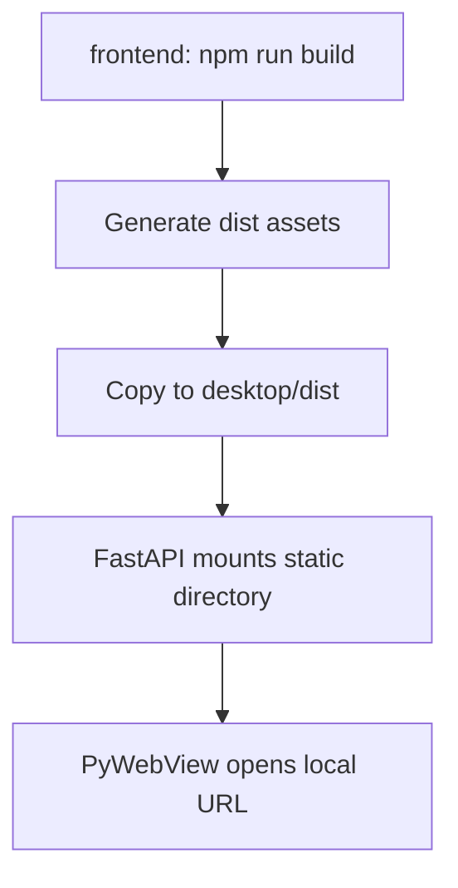

# Agent Playground

Agent Playground is a **local-first AI Agent desktop app**. The frontend is built with Vite + React, while the desktop wrapper uses Python + FastAPI + PyWebView to serve the static UI and launch a native window.

## Highlights

- Multi-tool routing: auto-selects `chat / webSearch / reasoning / image_generate / image_understand`
- Execution plan & progress: UI renders route, plan steps, and tool status
- Image generation & understanding
- Multi-session management: search, rename, delete
- Config center: model settings, capability checks, debug mode
- Local storage: settings and sessions stored in IndexedDB

## Tech Stack

- Frontend: Vite + React 19 + TypeScript + Tailwind CSS + MUI + Radix UI
- State: Zustand
- Desktop: FastAPI + Uvicorn + PyWebView
- Packaging: PyInstaller

## System Architecture



## Agent Execution Flow



## Desktop Boot Flow



## Repository Structure

```
.
├── agent.md               # AI engineering/agent design notes
├── README.md
├── desktop
│   ├── app.py             # FastAPI + PyWebView entrypoint
│   ├── app.spec           # PyInstaller config
│   └── dist               # Copied frontend build output
└── frontend
    ├── src
    │   ├── app            # Pages and components
    │   ├── core           # Agent core logic
    │   ├── store          # Zustand + IndexedDB
    │   └── types          # TypeScript types
    └── vite.config.ts
```

## Quick Start

### 1) Prerequisites

- Node.js 18+ (20+ recommended)
- Python 3.10+

### 2) Frontend Dev Mode

```bash
cd frontend
npm install
npm run dev
```

### 3) Build Web Assets (Required for desktop)

```bash
cd frontend
npm run build
```

Copy `frontend/dist` to `desktop/dist`.

### 4) Run Desktop App

Install Python dependencies in `desktop` (example):

```bash
pip install fastapi uvicorn pywebview python-dotenv
```

Create `.env`:

```bash
DESKTOP_APP_HOST='127.0.0.1'
DESKTOP_APP_PORT=10088
```

Start the desktop app:

```bash
cd desktop
python app.py
```

### 5) Package (Optional)

```bash
cd desktop
pyinstaller app.spec
```

## Model Configuration

Configure models in Settings with API Key and Base URL.

- Required roles: `chat` and `routing`
- Optional capabilities: `vision`, `webSearch`, `reasoning`, `image`
- `chatContextLength` controls history length passed to tools

## Data Storage

- Settings and sessions are stored in IndexedDB (`ai_agent_settings` / `ai_agent_sessions`)
- Memory fallback is used when IndexedDB is unavailable

## Key Entry Points

- `frontend/src/core/chat/agent.ts`: Agent aggregation/output
- `frontend/src/core/chat/router.ts`: Intent routing
- `frontend/src/core/chat/executor.ts`: Plan execution and progress
- `frontend/src/core/tools`: Tool implementations
- `desktop/app.py`: Desktop startup
