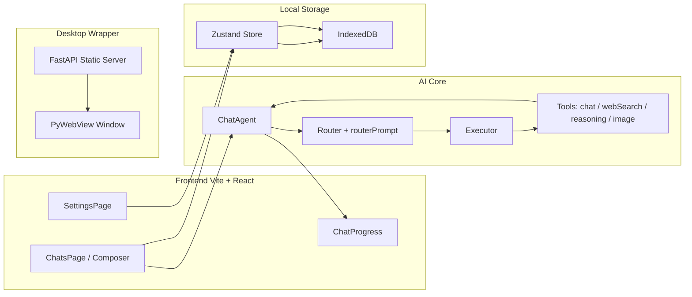
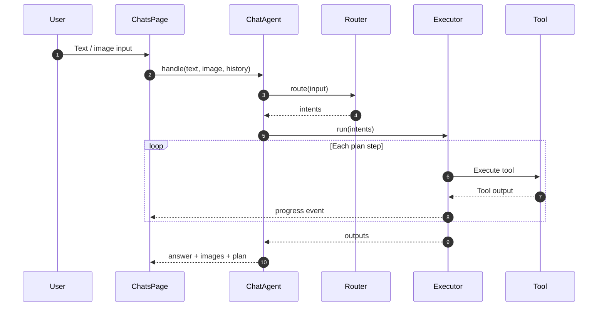
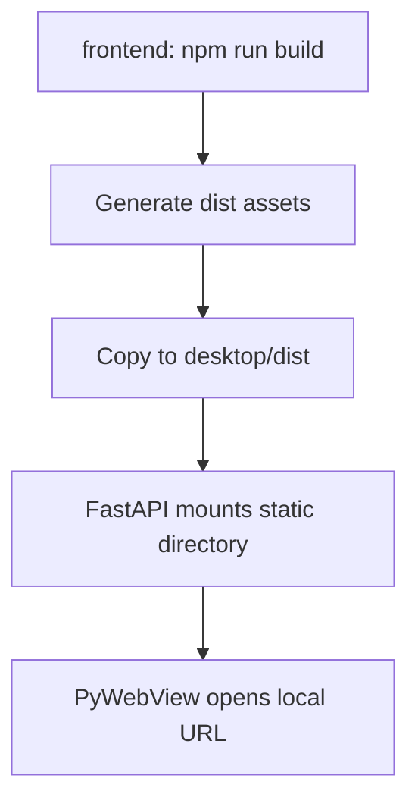

# Agent Playground

Agent Playground is a local-first multi-tool AI agent desktop application. The UI is built with Vite + React 19 + TypeScript, and the desktop shell uses FastAPI + PyWebView to host the compiled UI inside a native window. It is designed for experimenting with routing, tool orchestration, and execution plans without relying on any cloud-hosted backend.

## Table of Contents
- [Features](#features)
- [Architecture](#architecture)
  - [System Architecture](#system-architecture)
  - [Agent Execution Flow](#agent-execution-flow)
  - [Desktop Boot Flow](#desktop-boot-flow)
- [Repository Layout](#repository-layout)
- [Requirements](#requirements)
- [Getting Started](#getting-started)
  - [Frontend Development](#1-frontend-development)
  - [Build Frontend Assets](#2-build-frontend-assets)
  - [Desktop Runtime](#3-desktop-runtime)
  - [Package the Desktop App](#4-package-the-desktop-app)
- [Configuration](#configuration)
- [Data Storage](#data-storage)
- [Available Scripts](#available-scripts)
- [Troubleshooting](#troubleshooting)
- [License](#license)

## Features

- **Local-first desktop experience**: Everything runs on your machine. PyWebView serves the bundled UI through a FastAPI server and stores IndexedDB data alongside the app.
- **Multi-tool routing and execution**: The router decides between `chat`, `chat_with_image`, `web_search`, `reasoning`, and `image_generate`; the executor normalizes the plan, streams progress, and stitches the final answer.
- **Step-by-step visibility**: The UI shows routing decisions, execution plans, tool progress, and outputs so you can debug the agent loop in real time.
- **Image understanding & generation**: Inline data URLs are parsed, routed to `chat_with_image`, and generation is handled through the image tool.
- **Multi-session workspace**: Search, rename, delete, or favorite sessions. Everything is persisted in IndexedDB with graceful fallback to in-memory storage.
- **Config center**: Configure provider base URLs, API keys, capability checks, and model roles without editing source code.
- **Packaging-ready**: `desktop/app.py` loads `.env`, starts FastAPI + PyWebView, and can be frozen with PyInstaller via `desktop/app.spec`.

## Architecture

### System Architecture


```mermaid
flowchart LR
    subgraph UI[Frontend Vite + React]
        UIInput[ChatsPage / Composer]
        UISettings[SettingsPage]
        UIProgress[ChatProgress]
    end

    subgraph Core[AI Core]
        Agent[ChatAgent]
        Router[Router + routerPrompt]
        Exec[Executor]
        Tools[Tools: chat / webSearch / reasoning / image]
    end

    subgraph Data[Local Storage]
        Store[Zustand Store]
        IDB[IndexedDB]
    end

    subgraph Desktop[Desktop Wrapper]
        API[FastAPI Static Server]
        WebView[PyWebView Window]
    end

    UIInput --> Agent --> Router --> Exec --> Tools --> Agent --> UIProgress
    UIInput --> Store --> IDB
    UISettings --> Store --> IDB
    API --> WebView
```

### Agent Execution Flow


```mermaid
sequenceDiagram
    autonumber
    participant User as User
    participant UI as ChatsPage
    participant Agent as ChatAgent
    participant Router as Router
    participant Exec as Executor
    participant Tool as Tool

    User->>UI: Text / image input
    UI->>Agent: handle(text, image, history)
    Agent->>Router: route(input)
    Router-->>Agent: intents
    Agent->>Exec: run(intents)
    loop Each plan step
        Exec->>Tool: Execute tool
        Tool-->>Exec: Tool output
        Exec-->>UI: progress event
    end
    Exec-->>Agent: outputs
    Agent-->>UI: answer + images + plan
```

### Desktop Boot Flow


```mermaid
flowchart TD
    Build[frontend: npm run build] --> Dist[Generate dist assets]
    Dist --> Copy[Copy to desktop/dist]
    Copy --> FastAPI[FastAPI mounts static directory]
    FastAPI --> WebView[PyWebView opens local URL]
```

## Repository Layout

```
.
├── AGENT.md               # Agent usage instructions for this workspace
├── LICENSE                # Apache-2.0 license text
├── README.md              # You are here
├── desktop
│   ├── app.py             # FastAPI + PyWebView entrypoint (.env-aware)
│   ├── app.spec           # PyInstaller configuration
│   └── requirements.txt   # Minimal runtime dependencies
└── frontend
    ├── package.json       # Vite + React application scripts/deps
    ├── src
    │   ├── app            # Screens, composer, panels
    │   ├── core           # Agent, router, executor, prompts, tools
    │   ├── store          # Zustand store + IndexedDB helpers
    │   └── types          # Shared TypeScript types
    ├── public             # Static assets served by Vite
    └── vite.config.ts
```

## Requirements

- Node.js 18+ (20+ recommended) and npm
- Python 3.10+
- `pip` for installing desktop dependencies
- Optional: PyInstaller (only needed for packaging)

## Getting Started

### 1) Frontend Development

```bash
cd frontend
npm install
npm run dev
```

The Vite dev server hot-reloads UI changes and proxies API calls directly from the browser (no desktop layer needed).

### 2) Build Frontend Assets

```bash
cd frontend
npm run build
```

Copy the generated `frontend/dist` directory into `desktop/dist`. Symlinks also work during development if your OS supports them.

### 3) Desktop Runtime

1. Install dependencies:
   ```bash
   cd desktop
   python -m venv .venv && source .venv/bin/activate   # optional but recommended
   pip install -r requirements.txt
   pip install python-dotenv
   ```
2. Create `.env` in the repository root (next to `desktop/`) so `desktop/app.py` can load it:
   ```bash
   DESKTOP_APP_HOST=127.0.0.1
   DESKTOP_APP_PORT=10088
   ```
3. Run the desktop app:
   ```bash
   python desktop/app.py
   ```

FastAPI serves `desktop/dist`, and PyWebView opens `http://<DESKTOP_APP_HOST>:<DESKTOP_APP_PORT>` inside a native window. Windows-specific console tweaks and safe `window.open` overrides are applied automatically.

### 4) Package the Desktop App

```bash
cd desktop
pyinstaller app.spec
```

The spec file bundles FastAPI, PyWebView, and the pre-built static assets. Ensure `desktop/dist` already contains the latest build before packaging.

## Configuration

### Desktop `.env`

| Variable | Description | Default |
| --- | --- | --- |
| `DESKTOP_APP_HOST` | Address FastAPI binds to. Use `0.0.0.0` to expose beyond localhost. | `127.0.0.1` |
| `DESKTOP_APP_PORT` | Port for the static server + PyWebView target. | `10088` |

### In-app Settings

Open **Config Center** in the UI to set model credentials and behavior:

- Base URL + API key per provider role (`chat`, `routing`)
- Capability toggles for `vision`, `webSearch`, `reasoning`, and `image`
- Chat context length and per-session tool preferences
- Debug mode to expose low-level routing payloads

Settings are stored locally (no backend), so you can maintain different API keys per machine without touching source code.

## Data Storage

- Sessions and settings live in IndexedDB (`ai_agent_sessions`, `ai_agent_settings`).
- The Zustand store loads from IndexedDB at startup (`frontend/src/store/store.ts`).
- If IndexedDB is unavailable (e.g., private WebView modes), the store falls back to an in-memory cache.
- PyWebView writes Chromium data (including IndexedDB) to `desktop/app_data`, which can be deleted to reset local data.

## Available Scripts

### Frontend (`frontend/package.json`)

- `npm run dev` – Start Vite in development mode.
- `npm run build` – Produce production assets under `frontend/dist`.
- `npm run preview` – Preview the production build locally.
- `npm run format` – Run Prettier across the project.

### Desktop

- `pip install -r desktop/requirements.txt && pip install python-dotenv` – Install FastAPI, Uvicorn, PyWebView, PyInstaller, and load `.env` files for the desktop shell.
- `python desktop/app.py` – Launch the local desktop shell (requires `desktop/dist`).
- `pyinstaller desktop/app.spec` – Package the desktop app for distribution.

## Troubleshooting

- **Blank desktop window**: Ensure `desktop/dist` exists and contains the latest Vite build; FastAPI will 404 if the folder is missing.
- **Stale UI after rebuilds**: Delete `desktop/dist`, copy the new `frontend/dist`, and relaunch. Cached assets may persist otherwise.
- **IndexedDB errors**: Remove the `desktop/app_data` directory to reset storage. The app will recreate it on the next launch.
- **Port already in use**: Update `DESKTOP_APP_PORT` in `.env` and restart `desktop/app.py` so PyWebView points to the new port.
- **External links do not open**: `desktop/app.py` overrides `window.open` via PyWebView's JS bridge. Make sure the desktop window logs “window.open 已被重写” after load. If not, restart the app.

## License

Agent Playground is distributed under the [Apache License 2.0](LICENSE).
